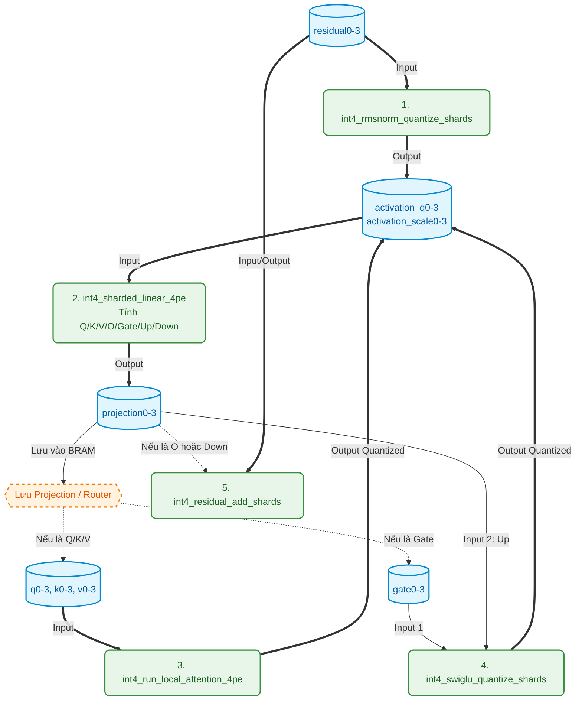
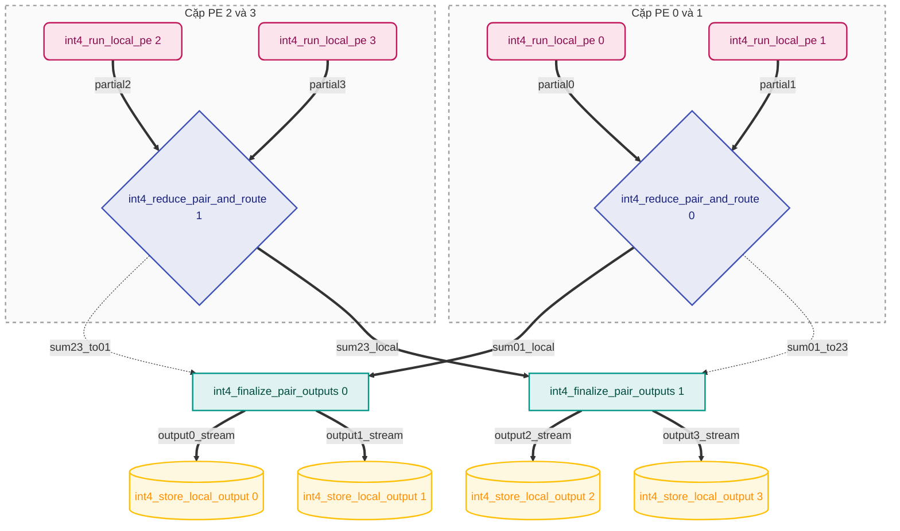

# Mô hình Kiến trúc Phần cứng - Int4 Decoder trên Alveo U250

Tài liệu này mô tả chi tiết kiến trúc phần cứng của hệ thống giải mã token (decoder) Int4 được triển khai trên FPGA Xilinx Alveo U250. Thiết kế được phân mảnh (sharded) trên 4 Super Logic Regions (SLR), tương ứng với 4 Processing Elements (PE).

## 1. Top Module: `int4_decoder_token_controller`

Đây là module gốc (top-level) giao tiếp trực tiếp với bộ nhớ DDR và điều khiển toàn bộ luồng dữ liệu của mạng nơ-ron (LLM Decoder Block). 

### Giao tiếp (Interfaces)
- **Điều khiển (s_axilite):** `position` (vị trí token hiện tại).
- **Bộ nhớ (m_axi, gmem0 - gmem3):** 
  - `model_bank[0-3]`: Chứa tham số mô hình (weights, scales, norms).
  - `rope_lut_pe[0-3]`: Bảng tra cứu cho RoPE.
  - `kv_cache_pe[0-3]`: Bộ nhớ đệm KV Cache.
  - `residual_pe[0-3]`, `logits_pe[0-3]`: Các luồng dữ liệu vào/ra.

## 2. Các tín hiệu nội bộ (Internal Signals / Memories)

Bên trong `int4_decoder_token_controller`, các khối nhỏ không kết nối với nhau bằng các dây dẫn (wires) đơn giản, mà thông qua các vùng nhớ đệm cục bộ (BRAM/URAM) hoặc luồng FIFO (hls::stream).

- **Vùng nhớ tham số (URAM):**
  - `scale_cache0-3`: Lưu tỷ lệ (scale) của trọng số.
  - `norm_cache0-3`: Lưu tham số gamma cho RMSNorm.
- **Vùng nhớ trung gian (BRAM):**
  - `residual0-3`: Trạng thái dòng chảy chính của mạng (Residual stream).
  - `projection0-3` (Scratchpad): Nơi chứa kết quả thô xuất ra từ mạch nhân ma trận Linear.
  - `q0-3`, `k0-3`, `v0-3`: Lưu trữ Query, Key, Value cho Attention.
  - `gate0-3`: Lưu trữ Gate cho hàm kích hoạt SwiGLU.
  - `activation_q0-3` (Int4) & `activation_scale0-3` (FP32): Các tín hiệu đã được lượng tử hóa (quantized) để làm đầu vào cho mạch Linear.
- **Luồng điều khiển (FIFO Streams):**
  - `token_pe0..3`, `command_pe0..3`: Các chuỗi token điều khiển được truyền nối tiếp qua 4 PE để đồng bộ hóa các khối `DATAFLOW` mà không gây tắc nghẽn (deadlock).

## 3. Sơ đồ phân cấp và Liên kết tín hiệu chi tiết

Sơ đồ dưới đây thể hiện luồng dữ liệu (Dataflow) đi qua các khối xử lý và các tín hiệu/vùng nhớ kết nối chúng:

## 4. Phân tích chi tiết lõi `int4_sharded_linear_4pe` (Bên trong khối nhỏ)

Khối nhân ma trận (Linear) là khối phức tạp nhất, được chia nhỏ thành 4 luồng chạy song song trên 4 SLR. Các tín hiệu bên trong khối này kết nối qua **hls::stream** (FIFO) để tạo mạng lưới tính toán và cộng gộp (Reduction Network).

### Các tín hiệu nội bộ của `int4_sharded_linear_4pe`:
1. **Dữ liệu đầu vào (Input streams):**
   - Lõi `int4_run_local_pe` đọc trọng số từ DDR và `activation_q` từ BRAM.
2. **Tín hiệu `partial0-3`:**
   - Là luồng stream `int4_reduction_packet_t` (chứa 4 giá trị float32). Đây là kết quả nhân ma trận cục bộ (partial GEMV) của mỗi PE.
3. **Mạng lưới cộng gộp (Reduction Network):**
   - **`sum01_local`, `sum23_local`**: Tổng của PE0+PE1 và PE2+PE3, giữ lại ở SLR hiện tại.
   - **`sum01_to23`, `sum23_to01`**: Tổng của PE0+PE1 được truyền xuyên qua ranh giới SLR sang cho PE2+PE3 (và ngược lại) thông qua các FIFO dài (`fifo impl=bram`). Đây là kết nối chéo vật lý duy nhất giữa các SLR.
4. **Dữ liệu đầu ra (Output streams):**
   - `output0-3_stream`: Kết quả GEMV hoàn chỉnh đã được cộng từ cả 4 PE, đưa vào `int4_store_local_output` để ghi ra BRAM `projection0-3`.
