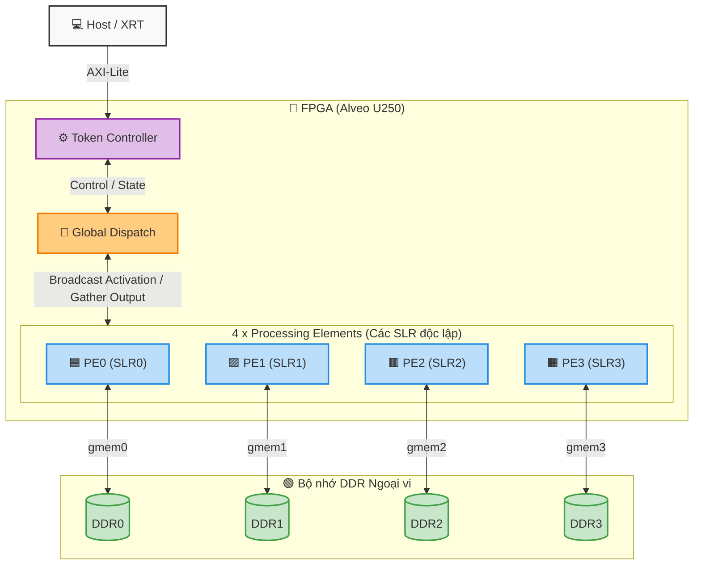
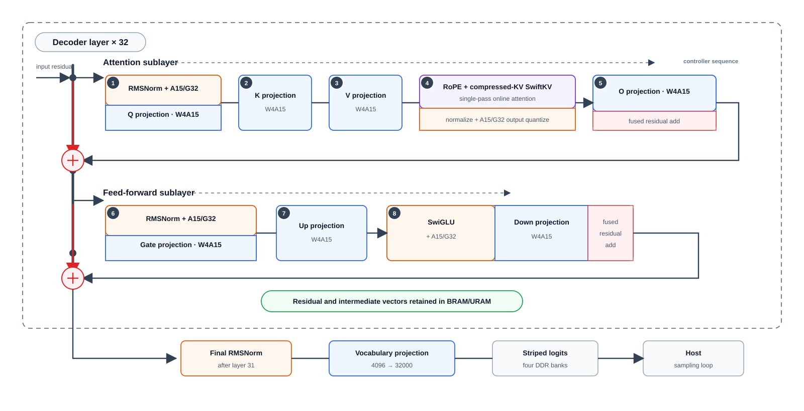
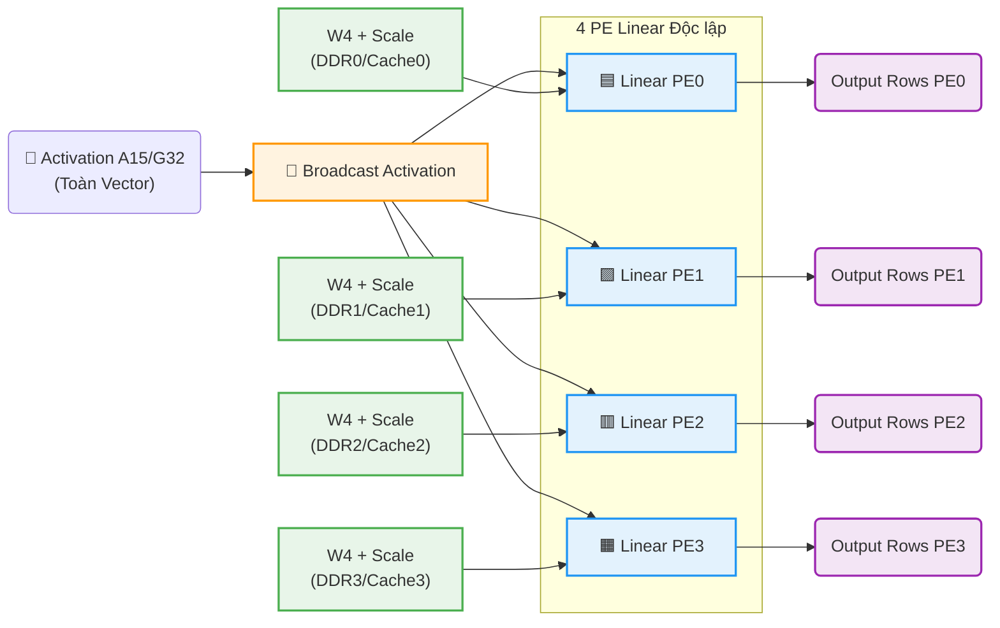
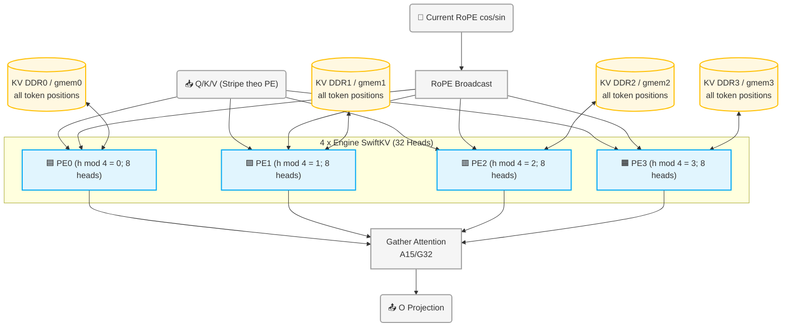
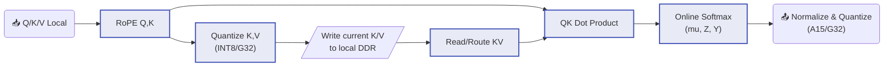
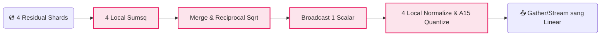
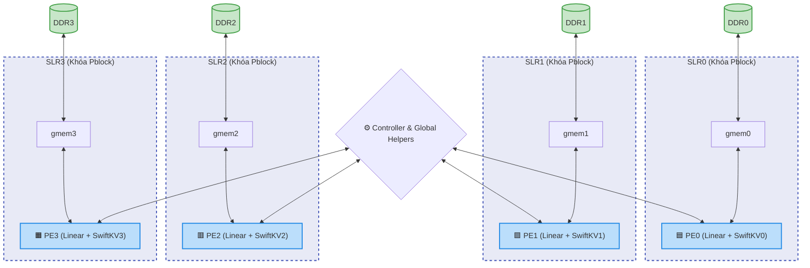

# Kiến trúc tổng thể bộ giải mã INT4 trên Alveo U250


Bản vector chỉnh sửa/phóng lớn không mất nét: [`U250_HIGH_LEVEL_ARCHITECTURE.svg`](U250_HIGH_LEVEL_ARCHITECTURE.svg).

## 1. Mục tiêu kiến trúc

Thiết kế thực hiện suy luận **một token** của mô hình decoder 32 lớp trên một kernel HLS duy nhất: `int4_decoder_token_controller`.

Kiến trúc được chia thành **4 Processing Element (PE) độc lập**. Mỗi PE:

- nằm trọn trong một SLR;
- gắn cố định với một kênh DDR và một AXI master riêng;
- giữ phần trọng số, residual, tensor trung gian và KV cache thuộc PE đó;
- có engine Linear INT4 riêng;
- có engine SwiftKV Attention riêng;
- không dùng chung một khối số học lớn với PE ở SLR khác.

Ánh xạ vật lý bắt buộc là:

| PE | SLR | AXI master | DDR bank | Dữ liệu chính |
|---:|:---:|:---:|:---:|---|
| PE0 | SLR0 | `gmem0` | DDR0 | model bank 0, residual 0, logits 0, KV 0, nguồn RoPE |
| PE1 | SLR1 | `gmem1` | DDR1 | model bank 1, residual 1, logits 1, KV 1 |
| PE2 | SLR2 | `gmem2` | DDR2 | model bank 2, residual 2, logits 2, KV 2 |
| PE3 | SLR3 | `gmem3` | DDR3 | model bank 3, residual 3, logits 3, KV 3 |

> “4 PE độc lập” ở đây có nghĩa là mỗi PE có toàn bộ datapath số học và bộ nhớ cục bộ riêng. Hệ thống vẫn cần một số kết nối xuyên SLR có chủ ý để broadcast activation, RoPE, tín hiệu điều khiển và gather kết quả. Các kết nối này được giữ ở dạng stream hoặc scalar; không có engine Attention/Linear lớn trải qua nhiều SLR.

## 2. Sơ đồ khối cấp hệ thống



Kernel chỉ có **một control plane**, nhưng có **bốn data plane song song**. Controller quyết định khối nào chạy trong từng trạng thái; các khối DATAFLOW bên trong xử lý stream song song.

## 3. Quan hệ giữa các khối lớn

| Khối lớn | Đầu vào chính | Đầu ra chính | Liên kết với khối khác |
|---|---|---|---|
| Token Controller | `position`, địa chỉ buffer, trạng thái lớp | mode và tham số cho từng stage | Điều phối toàn bộ chuỗi RMSNorm → Linear → Attention → FFN |
| DDR/AXI subsystem | model W4, residual, KV cache, RoPE | các burst 512 bit | Mỗi `gmemN` chỉ phục vụ PE N; `gmem0` còn nạp RoPE |
| Preload/cache | scale, norm gamma, RoPE | scale/norm/RoPE trong URAM | Nạp ở `position == 0`, sau đó tái sử dụng cho các token |
| RMSNorm + A15 quantizer | residual phân mảnh trên 4 PE, gamma | activation A15/G32 | Cấp activation cho Q, Gate và final logits Linear |
| Linear fabric 4 PE | activation A15/G32, W4, scale | FP32 tensor phân mảnh theo PE | Sinh Q/K/V, O, Gate, Up, Down và logits |
| SwiftKV fabric 4 PE | Q/K/V cục bộ, RoPE, KV cache | attention A15/G32 | Đầu ra nối trực tiếp sang O projection |
| SwiGLU + quantizer | Gate và Up cục bộ | activation A15/G32 | Đầu ra nối trực tiếp sang Down projection |
| Residual/staging buffers | tensor trung gian từng PE | tensor cho stage kế tiếp | Giữ dữ liệu on-chip giữa các phép toán trong một token |
| Gather/broadcast | stream từ/to 4 PE | một luồng logic toàn cục | Chỉ thực hiện phân phối và ghép thứ tự, không thay thế datapath PE |

## 4. Luồng xử lý một token

Khi `position == 0`, controller thực hiện bước khởi tạo một lần:

1. Nạp toàn bộ RoPE table 4096 vị trí từ DDR0 vào URAM.
2. Nạp scale của trọng số và gamma của RMSNorm từ bốn model bank vào bốn cache URAM cục bộ.

Ở mọi token, controller:

1. đọc cos/sin ứng với `position` từ RoPE URAM;
2. nạp bốn mảnh residual từ DDR0..DDR3 vào `residual_buffer0..3`;
3. chạy 32 lớp, mỗi lớp gồm đúng 8 stage;
4. chạy final RMSNorm và logits projection;
5. ghi bốn mảnh residual và logits về DDR tương ứng.

```mermaid
flowchart LR
    classDef init fill:#e8f5e9,stroke:#4caf50,stroke-width:2px;
    classDef attn fill:#e3f2fd,stroke:#2196f3,stroke-width:2px;
    classDef ffn fill:#fff3e0,stroke:#ff9800,stroke-width:2px;
    classDef end_node fill:#fce4ec,stroke:#e91e63,stroke-width:2px;

    R0("💿 Residual (4 mảnh)"):::init --> N1

    subgraph Attention_Block ["Self-Attention Block"]
        direction LR
        N1["1. RMSNorm + Q proj"]:::attn --> K["2. K proj"]:::attn
        K --> V["3. V proj"]:::attn
        V --> A["4. SwiftKV Attention<br/>(4 Engine)"]:::attn
        A --> O["5. O proj + add residual"]:::attn
    end

    O --> N2

    subgraph FFN_Block ["Feed-Forward Block"]
        direction LR
        N2["6. RMSNorm + Gate proj"]:::ffn --> U["7. Up proj"]:::ffn
        U --> S["8. SwiGLU + Down proj<br/>+ add residual"]:::ffn
    end

    S -->|"Lặp 32 Lớp"| N1
    S -->|"Sau lớp cuối"| FN("🏁 Final RMSNorm<br/>+ Logits proj"):::end_node
```



Controller dùng `INT4_NUM_LAYERS * 8 + 1 = 257` trạng thái tối đa. Việc giữ lịch cố định giúp tránh tạo một mạng điều khiển động lớn và làm rõ thời điểm từng AXI master được sử dụng.

### Fuse Decoder Operations & Schedule

Dưới đây là sơ đồ lịch trình điều phối cấp Token (Token-Level Schedule) của bộ điều khiển trung tâm đối với một Token duy nhất, kết hợp các phép toán Hardware Fusion để tối ưu băng thông.



File vector chi tiết: [`TOKEN_LEVEL_DECODER_SCHEDULE.svg`](TOKEN_LEVEL_DECODER_SCHEDULE.svg).

## 5. Kiến trúc Linear 4 PE

Các projection Q, K, V, O, Gate, Up, Down và Logits dùng chung cấu trúc gọi, nhưng **không dùng chung phần cứng giữa các PE**.



Mỗi `int4_run_pe_dataflow<N>` gồm năm stage:

1. **Stream input:** đọc W4 từ model bank N và scale từ cache N.
2. **Integer MAC:** nhân W4 với activation A15 theo tile.
3. **Dequantize:** áp dụng scale FP16 của trọng số và scale FP32/G32 của activation.
4. **Pack output:** đóng gói 16 giá trị FP32 vào một word 512 bit.
5. **Write output:** ghi vào buffer cục bộ; riêng O và Down có thể cộng residual ngay tại đây.

Các hàng output được stripe qua bốn PE. Vì vậy mỗi PE chỉ sở hữu trọng số và output rows của nó, nhưng cả bốn PE đều cần nhận toàn bộ activation đầu vào.

Các tham số chính:

| Tham số | Giá trị |
|---|---:|
| Model dimension | 4096 |
| KV dimension | 4096 |
| FFN hidden dimension | 11008 |
| Vocabulary | 32000 |
| Tile | 128 × 256 |
| Weight | W4 |
| Activation | A15, group 32 |
| Output packing | 16 × FP32 / 512-bit word |

## 6. Kiến trúc SwiftKV Attention 4 PE

SwiftKV được chia theo head:

- tổng cộng 32 attention head;
- head size 128;
- mỗi PE xử lý 8 local head;
- PE N chỉ đọc/ghi `kv_cache_peN` qua `gmemN`;
- mỗi PE có `swiftkv_run_bank` và đường KV-DDR riêng; không có persistent
  hot-KV cache trong URAM.



Bên trong mỗi SwiftKV PE:



KV cache của một token/head dùng 5 word 512 bit:

```text
[metadata 40 bit, K0 512 bit, K1 512 bit, V0 512 bit, V1 512 bit]
```

Mọi compressed KV record đều nằm trong DDR của đúng PE. Token hiện tại được
ghi DDR nhưng đồng thời đi trực tiếp vào attention stream; reader chỉ đọc
`position` token trước nên không tính current token hai lần. Attention dùng
online softmax một lượt với trạng thái `(mu, Z, Y)`, vì vậy không tạo và không
lưu toàn bộ score vector.

## 7. RMSNorm và SwiGLU

### RMSNorm

Residual được chia thành bốn mảnh, nên mỗi PE trước hết tính partial sum-of-squares cục bộ. Bốn scalar được merge để tính reciprocal RMS, rồi scalar này được broadcast lại cho bốn PE để normalize và lượng tử hóa A15/G32.



Đây là một kết nối xuyên SLR bắt buộc nhưng hẹp: partial sums và một hệ số chuẩn hóa, không phải một datapath vector FP32 lớn.

### SwiGLU

Mỗi PE đọc Gate và Up cục bộ, tính SwiGLU cục bộ, rồi lượng tử hóa A15/G32. Các stream được gather theo đúng thứ tự để đưa thẳng vào Down projection.

## 8. Bộ nhớ on-chip chính

| Bộ nhớ | Số bản | Loại | Vai trò |
|---|---:|:---:|---|
| `residual_bufferN` | 4 | BRAM 2P | residual shard của PE N |
| `linear_stageN` | 4 | URAM 2P | tensor FP32 trung gian của PE N |
| `q_peN`, `k_peN`, `v_peN` | 12 | BRAM | Q/K/V shard cho SwiftKV PE N |
| `gate_peN`, `up_peN` | 8 | BRAM | input cục bộ của SwiGLU |
| `model_scale_cacheN` | 4 | URAM | scale trọng số cục bộ |
| `model_norm_cacheN` | 4 | URAM | RMSNorm gamma cục bộ |
| `activation_q` | 1 logic buffer | BRAM | nhóm activation A15, word 480 bit |
| `activation_scale` | 1 logic buffer | BRAM | scale FP32 theo group |
| `rope_lut` | 1 | URAM | cos/sin cho 4096 vị trí |
| `current_cos`, `current_sin` | 1 cặp | BRAM | RoPE của token hiện tại |

Các array có hậu tố `N` phải được đặt cùng PE N. Những buffer dùng để broadcast/gather có thể nằm gần ranh giới SLR, nhưng không được kéo cả hierarchy số học PE ra khỏi pblock của nó.

## 9. Các đường xuyên SLR được phép

| Đường dữ liệu | Bề rộng/đặc tính | Lý do cần thiết |
|---|---|---|
| Controller → 4 PE | trạng thái và tham số nhỏ | Đồng bộ stage/layer |
| Activation broadcast | stream nhóm A15/G32, group data 480 bit | Mỗi Linear PE cần toàn activation để tính các output rows của mình |
| Linear/Attention gather | stream group data + scale | Khôi phục thứ tự logic trước stage kế tiếp |
| RMSNorm reduction | bốn partial scalar, một reciprocal scalar | RMSNorm phụ thuộc toàn vector |
| RoPE broadcast | cos/sin hiện tại, phần tử 19 bit | Cả bốn SwiftKV PE dùng cùng vị trí token |
| Done/empty/full handshake | tín hiệu điều khiển FIFO | Backpressure giữa DATAFLOW processes |

Để tránh lỗi localized SLL congestion:

- không đặt `swiftkv_run_pe<N>` khác SLR với Linear PE N;
- không cho một SwiftKV engine phục vụ hai DDR/SLR;
- giữ `kv_cache_peN` trên đúng `gmemN`/DDRN, không truy cập chéo bank;
- không tạo một vector FP32 dùng chung chạy qua cả bốn SLR nếu có thể dùng stream A15/G32;
- giữ FIFO/broadcast/gather rõ ràng để Vivado có thể chèn pipeline và phân bố SLL;
- hard pblock bốn PE, sau đó dùng placer directive `SSI_SpreadSLLs` cho phần kết nối còn lại.

## 10. Sơ đồ vật lý mục tiêu



Mỗi pblock bao trọn hierarchy PE tương ứng và bật `CONTAIN_ROUTING`. Mục đích là buộc cả logic lẫn routing nội bộ của PE ở lại SLR đã chọn, thay vì chỉ khóa một vài leaf cell rồi để datapath lan sang SLR bên cạnh.

## 11. Tài nguyên HLS hiện tại

Kết quả C synthesis hiện tại của top kernel ở target 300 MHz:

| LUT | FF | DSP | BRAM18K | URAM | Estimated Fmax |
|---:|---:|---:|---:|---:|---:|
| 273,086 | 362,535 | 778 | 1,242 | 422 | 300.03 MHz |

Riêng hierarchy `swiftkv_run_four_pes`:

| LUT | FF | DSP | BRAM | URAM |
|---:|---:|---:|---:|---:|
| 155,109 | 186,030 | 292 | 476 | 128 |

Mỗi SwiftKV PE có 37,896 LUT, 45,055 FF, 73 DSP, 104 BRAM và 32 URAM.
32 URAM/PE còn lại thuộc các FIFO K/V streaming, không phải persistent KV
cache. Các số trên là estimate sau HLS synthesis; chúng không thay thế báo
cáo utilization/timing sau place-and-route. Lần route trước đã dừng ở initial
routing do localized SLL/global congestion, vì vậy bitstream và timing
post-route vẫn cần được xác nhận lại sau khi áp dụng floorplan mới.

## 12. Quy tắc bất biến của kiến trúc

1. Chỉ có **một kernel/CU top**, không tách thành bốn kernel độc lập.
2. Có đúng **4 AXI master**, một master cho mỗi DDR/PE.
3. `PE N ↔ gmemN ↔ DDRN ↔ SLRN`; không tráo bank giữa các PE.
4. Bốn Linear PE và bốn SwiftKV PE là các hierarchy số học độc lập.
5. Trọng số, KV, residual và tensor trung gian của PE N phải ở local bank/cache/buffer N.
6. Chỉ scalar hoặc stream có cấu trúc rõ ràng được phép đi qua SLR.
7. O projection và Down projection cộng residual tại output path để tránh thêm một vòng buffer toàn cục.
8. Attention không materialize score vector; KV cache dùng INT8/G32 và online softmax một lượt.
9. Mọi thay đổi floorplan phải kiểm tra lại `report_route_status`, SLL crossing theo net/hierarchy và congestion theo SLR.

## 13. Ánh xạ tài liệu sang source

| Chức năng | Source chính |
|---|---|
| Top controller, AXI ports, state machine | `source/int4_decoder_controller.cpp`, `source/int4_decoder_controller.hpp` |
| RMSNorm, SwiGLU và orchestration blocks | `source/int4_decoder_blocks.cpp`, `source/int4_decoder_blocks.hpp` |
| Linear W4 × A15 4 PE | `source/int4_linear_controller.cpp`, `source/int4_linear_controller.hpp` |
| SwiftKV Attention 4 PE | `source/swiftkv_attention.cpp`, `source/swiftkv_attention.hpp` |
| DDR connectivity và placer directive | `u250_int4_connectivity.cfg` |
| Hard pblock PE0..PE3 | `place_int4_pes_u250.tcl` |
| Tài liệu chi tiết controller | `INT4_DECODER_U250.md` |
| Tài liệu budget/latency | `PERFORMANCE_BUDGET_U250.md` |

Tài liệu này mô tả **kiến trúc mục tiêu hiện tại của source**, trong đó bốn PE độc lập và được đóng gói theo SLR. Các file RTL cũ đã sinh trước lần sửa có thể vẫn chứa tên hierarchy `swiftkv_run_pair`; khi đánh giá kiến trúc hoặc chạy implementation phải regenerate XO/RTL từ source mới.
